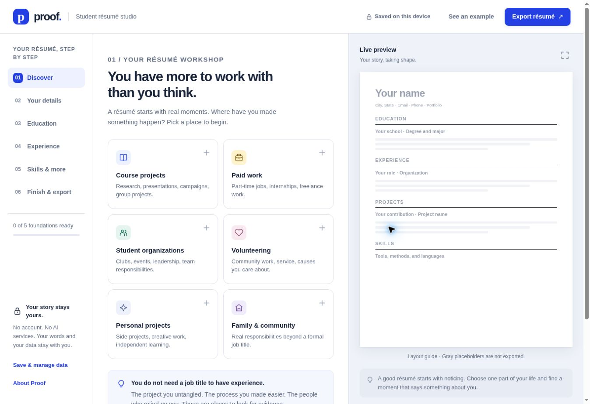

# Proof

An independent, open source résumé workshop for students. Turn real experiences into specific, defensible contributions, then export an editable Word document.

**Open `index.html` in a modern browser. No installation, account, internet connection, or API key is needed.**



## Deploy to Cloudflare Pages

In Cloudflare, choose **Workers & Pages → Create application → Pages → Import an existing Git repository** and connect `mralexgarrido/proof-resume`.

| Setting | Value |
| --- | --- |
| Production branch | `main` |
| Framework preset | `None` |
| Build command | `npm run build` |
| Build output directory | `dist` |
| Root directory | Leave blank, using the repository root |
| Node version | Node 22, selected by `.node-version` |
| Secrets and runtime variables | None required |

`npm run build` runs the eight core tests, then creates `dist/index.html` and `dist/_headers`. A failing test stops the build. The production build and tests use only Node built-ins; dependency installation is needed only for the optional Vite development server. For faster Pages builds, you may set the build environment variable `SKIP_DEPENDENCY_INSTALL=1`.

The repository includes `wrangler.jsonc` with `pages_build_output_dir: "./dist"`. This is a **Pages** project. Select the Pages Git integration rather than a Workers deployment flow. No Worker entrypoint, Pages Functions, database, API keys, or deploy command is needed in the Pages Git setup.

Leave Cloudflare Web Analytics and other script injection disabled to preserve the application's no-external-calls requirement. The app's content security policy blocks remote scripts and connections.

After connecting the repository, Cloudflare supplies the deployment URL and publishes successful builds from `main`. A GitHub commit alone does not create or connect a Cloudflare Pages project. See [Cloudflare's static HTML guide](https://developers.cloudflare.com/pages/framework-guides/deploy-anything/), [build configuration](https://developers.cloudflare.com/pages/configuration/build-configuration/), and [build environment](https://developers.cloudflare.com/pages/configuration/build-image/).

## Why this exists

The hardest part of a first résumé often happens before the writing: recognizing what counts as experience and finding the evidence behind it. Proof helps students work through that step. Marketing and business examples lead the experience, with prompts for all majors.

This is a general résumé builder. It does not scrape job postings, generate AI claims, or calculate a supposed hiring probability.

## Student workflow

1. Discover experience in coursework, paid work, clubs, volunteering, personal projects, or family and community responsibilities.
2. Add contact details and education.
3. Describe your action, method, and outcome. Assemble an editable bullet from your own answers, or write it directly.
4. Keep private notes about the evidence and judgment behind your work. Review your claims.
5. Add concrete skills and relevant highlights.
6. Reorder sections, choose typography and spacing, and download a `.docx` file.

The live preview shows a skeleton until you add content. Empty sections and private notes are excluded from résumé exports. A separate blank Word template is also available. All examples are fictional and never prefill your own résumé.

## Privacy and offline use

- The distributed HTML is self-contained: embedded CSS and JavaScript, system fonts, no external assets, network calls, tracking, accounts, AI services, or server processing.
- A content security policy includes `connect-src 'none'` and `font-src 'none'`.
- Local saving uses this browser's localStorage. It does not sync between devices. Users can turn it off and clear the saved draft.
- On shared computers, turn local saving off. Browser storage is not encrypted and should not be treated as a secure vault.
- A JSON backup includes both résumé data and private evidence notes. A Word export includes only résumé content.
- The “Download offline app” action produces a clean HTML application without the user's draft. Save a backup separately to move the draft.
- Hosting the page means the host receives the initial page request and ordinary connection metadata. The app itself does not upload résumé data.
- Optional browser-native WebMCP registration exposes only section navigation. It does not read résumé content, send requests, or export files. It is feature-detected and unnecessary for normal use.

## Word output

Word documents are generated locally as standards-based Office Open XML in a ZIP container. The exporter uses real paragraphs, heading styles, and numbered-list bullet definitions. Content is selectable and editable; it is not an image or an HTML file renamed `.docx`.

Defaults: US Letter, a single column, Arial 11 pt, black text, and generous margins. Classic uses Georgia; compact uses 10.5 pt. The browser preview is approximate. Word and other editors can paginate differently, so review the final file before submitting.

The app does not promise universal applicant-tracking-system compatibility. Clear headings and simple text are deliberate design choices, not an ATS certification.

## Source and development

`index.html` is the complete application and source. There are zero runtime dependencies. It contains a pure `proof-core` script and a DOM-based `proof-ui` script. The pure core is shared by the UI and tests.

```sh
npm ci
npm run dev
npm test
npm run build
```

Node 22.13+ is required for development. Vite is a development-only dependency. After running the core tests, the build copies the self-contained application to `dist/index.html` and the Cloudflare header rules to `dist/_headers`. It adds no bundled assets or runtime network dependencies. You can run the application without Node by opening the HTML directly.

The strict production CSP intentionally blocks Vite's injected development client. Editing the source requires a manual browser refresh. This keeps the tested app's privacy policy intact.

## Deploy anywhere

Upload `dist/index.html` to any static host, including GitHub Pages, Cloudflare Pages, or a university web server. No backend, secrets, database, or build service is needed. Use `npm run build` if a host expects a build command and choose `dist` as its output directory.

Only the generated `dist` directory should be deployed. The source, tests, documentation, and example screenshot stay in the repository. Do not commit real student backup files or generated résumés.

## Testing

`npm test` checks evidence-only sentence assembly, backup validation, Unicode/XML safety, ZIP checksums, editable Word structure, private-note exclusion, hidden-entry exclusion, section ordering, and the absence of network APIs or remote assets. Manual browser and export checks are recorded in `QA.md`.

## Accessibility and limitations

The app uses labeled native controls, keyboard-accessible navigation and dialogs, visible focus states, a skip link, responsive layouts, reduced-motion support, and status announcements. This is not a claim of a formal accessibility certification.

Current scope is English-language, general student and early-career résumés. It is not a full academic CV builder. It does not import Word/PDF files, synchronize devices, or infer the truth of a user's claims. Feedback is transparent rule-based coaching, not a grammar engine. JSON backups from other versions or products are intentionally rejected.

## License and contribution

MIT licensed. See `LICENSE`, `CONTRIBUTING.md`, and `docs/product-rationale.md`. Adapt it for a classroom, translate prompts, or improve the editor while preserving the offline and privacy requirements.
