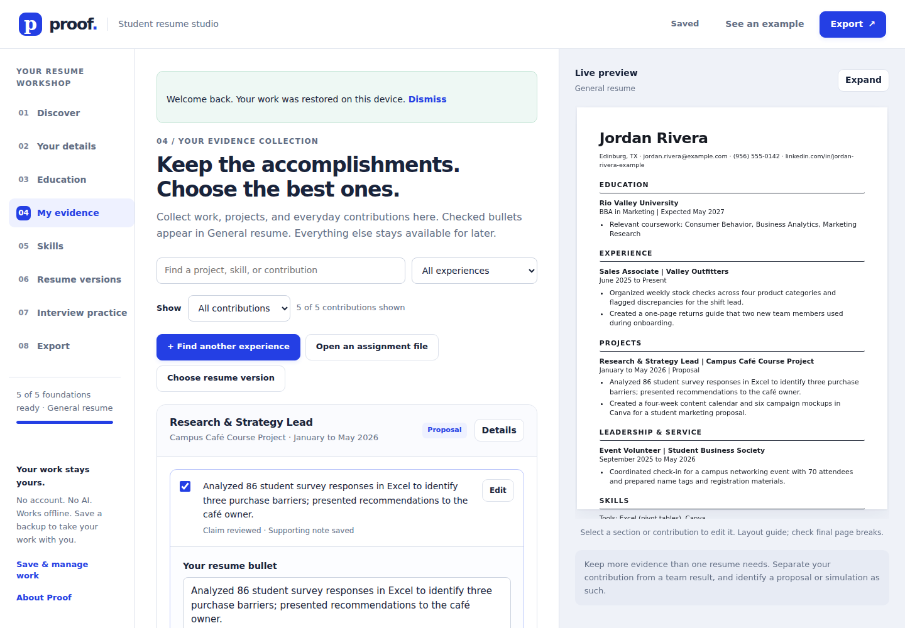

# Proof

An independent, open source resume workshop for students. Start with one rough memory, collect evidence of your contributions, and choose how to explain that work for each opportunity.

**Open `index.html` in a modern browser. No installation, account, internet connection, API key, or AI service is needed.**



Marketing and business examples lead, with prompts and practice projects for all majors. You supply the facts, write in your own voice, and decide what to share.

Proof 2.1 helps you continue saved work, find the right evidence, and address specific details before sharing. The project data format remains version 2, with support for older version 1 backups.

## Student workflow

1. **Capture one real moment.** Choose coursework, paid work, a student organization, volunteering, a personal project, or a family and community responsibility. Rough words are enough. Optional questions help you remember decisions, limitations, useful artifacts, and responsibilities.
2. **Build your evidence collection.** Keep several contribution cards within one experience. Add your action, method, and actual result or deliverable. Assemble a draft from your answers or write the bullet yourself. Compare and edit the wording before using it. When you return, Continue opens a saved draft or the next specific detail to address.
3. **Keep supporting details privately.** Record artifact references, measurement calculations, decisions, and lessons. Identify your own part in team work. Mark proposals, simulations, and prototypes accurately, then review the claim yourself.
4. **Add details, education, and skills.** Connect each skill to contributions showing where you practiced it. Practice descriptions record your experience; they are not competence scores.
5. **Create focused resume versions.** Each version keeps its own selected contributions and skills, headline, introduction, presentation settings, and optional adapted bullet wording. Shared library wording and adapted version wording have clearly identified reviews. The full collection remains available.
6. **Map an opportunity manually.** Paste a description locally, select requirements, and link them to evidence. Include a linked contribution or adapt its wording directly from the requirement. The app distinguishes evidence included in this version, evidence available in the collection, and requirements needing a connection. Literal phrase matches and a small bundled vocabulary suggest possible connections. You decide whether they are relevant.
7. **Practice the interview.** Choose a contribution, review follow-up questions, keep private preparation notes, and use the speaking timer. Export questions separately, with an explicit choice to include private notes.
8. **Review and export.** Open targeted suggestions for missing contact information, education, experience context, dates, selected claim reviews, repeated wording, and skills. Suggestions take you to the relevant field or version wording. They do not block draft downloads. Reorder sections, choose Letter or A4, and download editable Word or plain text. Use browser print to save a PDF. A blank Word template and peer review copy are also available.

The live preview shows the selected version. Empty contributions and sections are omitted. All examples and sample resumes are fictional and never prefill your work. The visible writing checks do not establish truth, predict employment, or calculate an ATS score.

My evidence offers views for all contributions, this resume's selected contributions, unselected contributions, claims to review, and draft memories. Search includes the active version's wording, shared wording, and private supporting notes, while export still includes only selected public content. Row wording and review status update as you edit. Private reflection and theme changes preserve an existing claim review; changes to the claim or its supporting evidence require another review.

Numeric coaching distinguishes quantities from labels such as GA4, 3D, and Microsoft 365. Interview practice supports a finished adapted bullet even when the shared library bullet has not yet been written.

## Practice projects and assignment files

Bundled project starters help you plan work you could complete and demonstrate. Saving a project plan records it privately. Add a contribution after doing the work; a plan is not automatically treated as an accomplishment.

Proof previews compatible local `proof-evidence` version 1 JSON files. Imported cards start unreviewed and enter the collection without selection in a resume version. The student edits and selects them explicitly. See [the handoff specification](docs/handoff.md). This release does not add integrations to other assignment tools.

## Saving, recovery, and privacy

- The distributed HTML is self-contained: embedded CSS and JavaScript, system fonts, and no external assets, network calls, tracking, accounts, AI services, or server processing. Its CSP includes `connect-src 'none'` and `font-src 'none'`.
- Optional local saving uses this browser's localStorage. It does not synchronize devices. Turn saving off on a shared computer; browser storage is not encrypted.
- Undo and redo operate during the current session. Named restore points keep up to five copies of the whole project on this device. Downloaded JSON backups are separate portable files.
- A project backup includes **all versions and private notes**. Resume Word, text, print, and peer review exports exclude evidence, reflection, interview notes, practice descriptions, and pasted opportunity descriptions.
- Interview exports exclude private notes by default. You can explicitly include them for your own preparation.
- Another tab's conflicting saved changes require a choice before overwriting. If saved data cannot be opened, the app offers the original stored text as a recovery download. Damaged restore-point history is handled separately and does not disable saving a valid main project.
- Version 1 Proof backups migrate into the expanded collection and first version, retaining bullets, private notes, inclusion choices, and claim reviews. Version 2 backups preserve stable links and version-specific wording. Invalid or oversized content is rejected rather than silently shortened.
- **Download offline app** produces clean HTML without your personal data. Save a project backup separately to move your work.
- A hosted copy requires an initial page request, which the host receives. The app itself does not upload resume data. Word contact links can open their destinations when a reader chooses them.

If device storage cannot keep a restore point before a project replacement or reset, Proof prepares a downloadable backup of the current project first. Keep that file for recovery.

Clearing saved copies removes device drafts and restore points while leaving the current session open. Download a backup before closing to keep that session's work.

## Word output

Word files are generated locally as Office Open XML in a ZIP container, with selectable text, semantic heading styles, real bullets, and clickable email and valid web contact links.

Defaults are US Letter, a single column, Arial 11 pt, black text, and readable margins. Classic uses Georgia; compact uses 10.5 pt. A4 is available. Experience headings and context stay with the first bullet where the editor supports those layout settings. The preview is approximate, so review final page breaks in Word or another compatible editor before submitting.

Clear headings and simple text are deliberate design choices, not a promise of universal applicant-tracking-system compatibility.

## Source and development

The editable source lives in `src/`:

| File | Responsibility |
| --- | --- |
| `core.js` | Data model, validation, migration, resume projection, local coaching |
| `content.js` | Bundled questions, verbs, fictional examples, projects, labels |
| `export.js` | Local Word, text, and interview preparation exports |
| `ui.js` | Interactions, local saving, recovery, workflow |
| `styles.css` | Responsive application, preview, and print styles |
| `shell.html` | Application shell and assembly placeholders |

`scripts/assemble.mjs` combines these sources into the committed, self-contained `index.html`. There are zero runtime dependencies. Edit source files, then reassemble; direct edits to generated `index.html` will be overwritten.

```sh
npm test
npm run build
```

Tests and production packaging use Node built-ins, so those commands need no dependency installation. Development requires Node 22.13+. The optional Vite server uses development dependencies:

```sh
npm ci
npm run dev
```

The production CSP blocks Vite's injected client. After editing source, run `npm run assemble` and refresh the browser manually. The assembled app can be opened directly without Node.

## Deploy to Cloudflare Pages

Choose **Workers & Pages → Create application → Pages → Import an existing Git repository** and connect `mralexgarrido/proof-resume`.

| Setting | Value |
| --- | --- |
| Production branch | `main` |
| Framework preset | `None` |
| Build command | `npm run build` |
| Build output directory | `dist` |
| Root directory | Repository root |
| Node version | Node 22.13+ |
| Secrets and runtime variables | None required |

The build assembles the app, runs automated tests, and produces only `dist/index.html` and `dist/_headers`. A failing test stops it. For Pages builds without dependency installation, you can set `SKIP_DEPENDENCY_INSTALL=1`.

Use the Pages Git integration. No Worker entrypoint, Pages Functions, database, API keys, or deploy command is needed. Leave Web Analytics and script injection disabled to preserve the no-external-calls requirement.

Once connected, Cloudflare supplies a deployment URL and publishes successful builds from the production branch. A GitHub commit alone does not create a Pages project. See Cloudflare's [static HTML guide](https://developers.cloudflare.com/pages/framework-guides/deploy-anything/) and [build configuration](https://developers.cloudflare.com/pages/configuration/build-configuration/).

Other static hosts can serve the generated app. Deploy only `dist`; keep source, tests, documentation, and screenshots in the repository. Never commit real student backups or resumes.

## Testing and limitations

`npm test` covers validation, legacy migration, stable references, independent variants, sentence assembly, opportunity matching, measurement arithmetic, handoff imports, Word structure, hyperlink safety, Unicode/XML safety, ZIP checksums, private-note exclusion, and network restrictions. Browser and rendered-document checks are recorded in [QA.md](QA.md).

Optional browser suites use a separately supplied Playwright and Chromium installation:

| Command | Coverage |
| --- | --- |
| `npm run test:browser` | Complete student workflow, downloads, privacy, recovery, responsive layouts |
| `npm run test:review` | Continuation, targeted review, evidence views, wording scopes, live feedback, adapted interviews, long content |
| `npm run test:reliability` | Input cleanup, immediate Undo, damaged history, import races, requirement limits, revision boundaries |

Browser tooling is excluded from production packaging. See [QA.md](QA.md) for setup and the current verification status.

The app includes labeled controls, keyboard-accessible navigation and dialogs, visible focus states, a skip link, responsive layouts, reduced-motion support, and status announcements. This is not a formal accessibility certification.

Scope is English-language resumes for students and early-career applicants. Proof is not a full academic CV builder. It does not import Word/PDF files, synchronize devices, infer truth, or assess interviews automatically. Its writing checks are visible rules, not a general grammar engine.

MIT licensed. See [CONTRIBUTING.md](CONTRIBUTING.md) and [the product rationale](docs/product-rationale.md).
